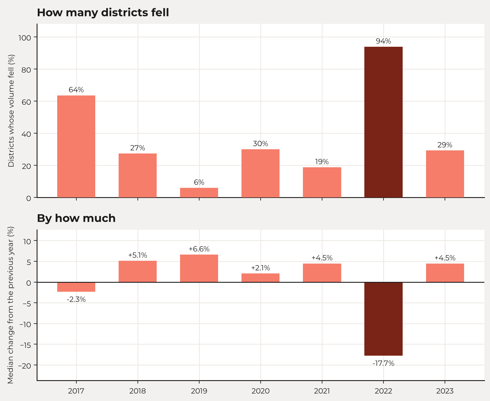
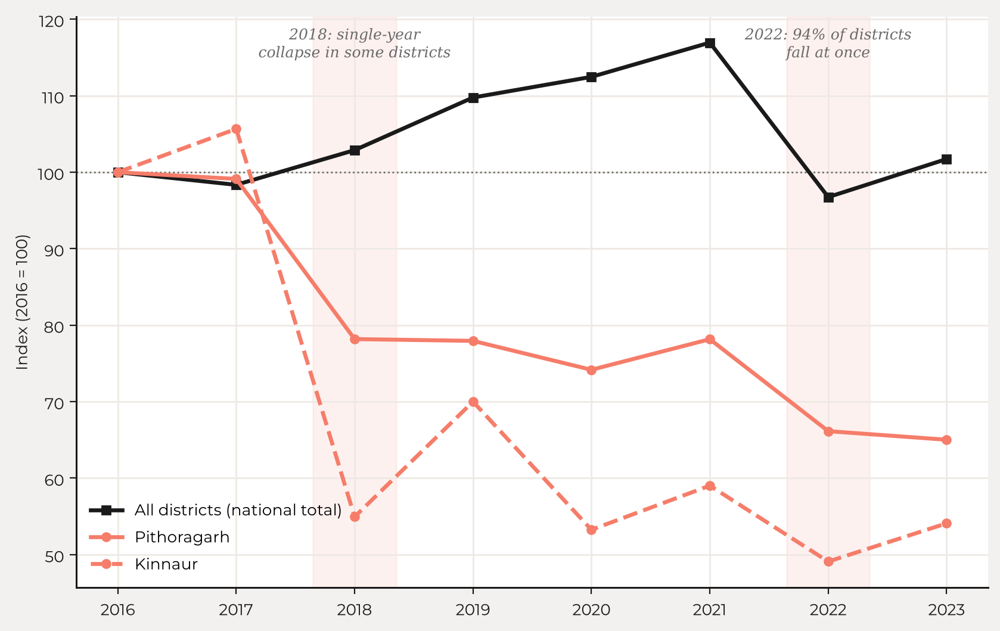
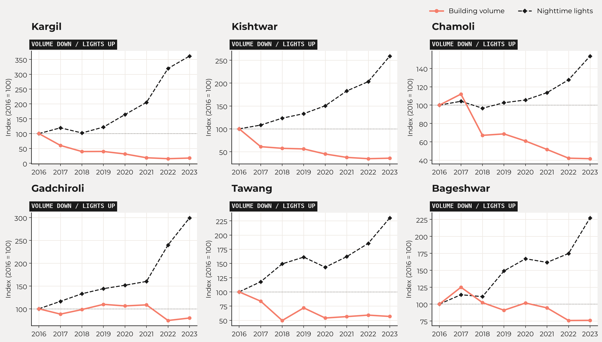

### Problems in the building volume data

The building volume data is released as published by Google, without a cleaning pass of our own, and its problems are visible. Four are worth setting out.

The first is 2022. In that year, building volume fell in 94% of districts, and the median district fell by 18%. This is not a handful of districts dragging the national total down. It is across the board, and we do not know why.

*Top: the share of districts whose building volume fell against the previous year. Bottom: the median district's change against the previous year. In 2017 most districts fell, but the typical fall was small.*

The second is 2018. Some districts show a single-year collapse in that year from which they never recover. Kinnaur's building volume falls by almost 50% and Pithoragarh's by 20%. Others decline continuously over the whole period. It is hard to believe that half the buildings in Kinnaur disappeared in a year.

*Building volume for Pithoragarh and Kinnaur against the national total, indexed to 2016 = 100. The shaded years are 2018 and 2022.*

The third is a known limitation, not a puzzle. Building height in the source data is capped at 100 metres, so the tallest structures are truncated, which matters most in the big cities.

The fourth is geographic. Of the six districts where the two measures disagree most, five are in the Himalayas: Kargil, Kishtwar, Chamoli, Bageshwar and Tawang. So are Kinnaur and Pithoragarh, the two districts with the sharpest single-year collapses.

*The six largest disagreements between the two measures, 2016 to 2023, each indexed to 2016. In every one, measured capital falls while activity brightens.*

That concentration points to measurement rather than economics. A model that estimates footprint and height from imagery has more to contend with in steep terrain. We have not established this, but it is the first hypothesis we would test, and it is the kind of question that ground truth settles.

