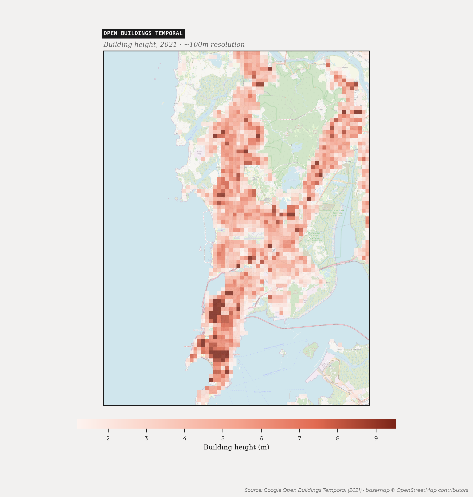
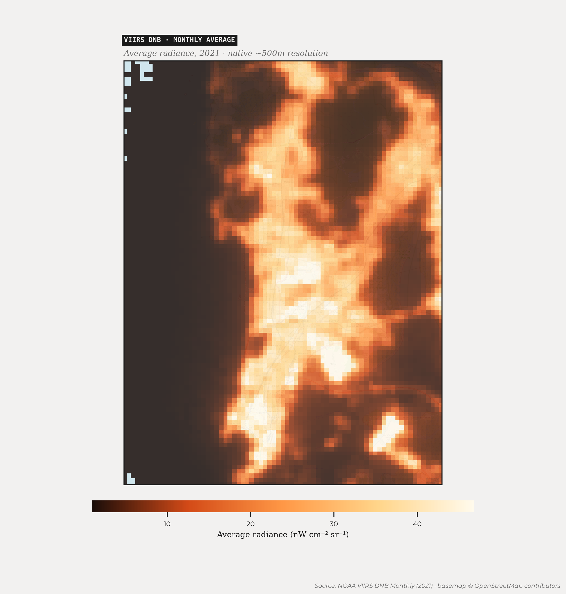
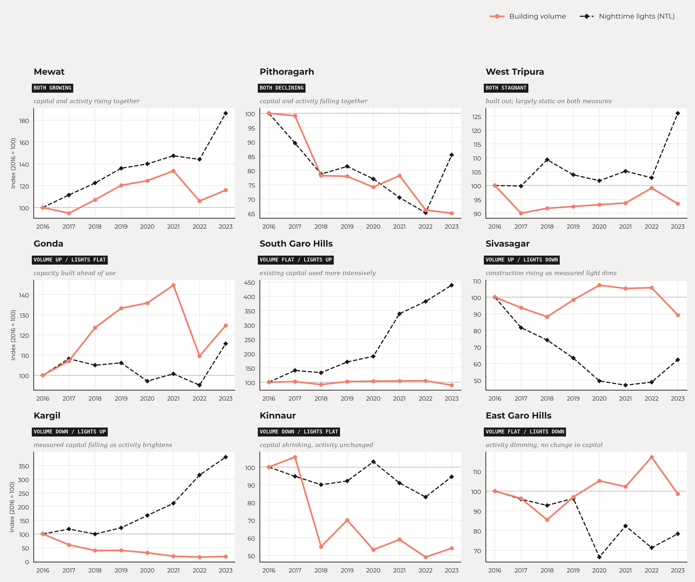

By [AUTHOR NAME]. Comparing how fast two Indian districts are growing is more frustrating than it ought to be. 

While India's statistical machinery does produce a staggering quantity of data, it is rarely cooperative. It is often outdated, available at inconvenient resolutions, and occasionally simply absent. We know relatively little about how economic activity changes from one district to another in real time. We know even less about something as fundamental as the stock of physical capital. 

There is no official district-level measure of how much has been built, or how quickly the built-up environment is changing. Yet infrastructure, industrial concentration, and urban growth—the very indicators that matter most for public policy—are uncooperatively determined at the sub-state level. For example, Lall and Chakravorty (2005) find that the spatial concentration of industry within India is itself a primary cause of income inequality across regions, and that concentration happens at a resolution finer than the state. Aggregated, lagged statistics hide much of the story.

Satellite data offers a solution to this problem. 

Every few days, satellites record the changing surface of the Earth. Buildings appear, urban centres expand, industrial enclaves emerge, and after sunset settlements brighten or dim as economic activity ebbs and flows. None of this was designed as an economic indicator, but together these traces reveal patterns of economic development that were previously impossible to observe. The idea has a solid pedigree: Henderson, Storeygard and Weil (2012) used the growth of nighttime lights to measure economic growth in places where the national accounts are weak, and Chen and Nordhaus (2011) worked out the conditions under which luminosity adds information to conventional statistics rather than merely restating them.

Unfortunately, working with satellite data is its own can of worms. Processing the raw image data available in esoteric formats, normalising and bias correcting due to myriad factors; anyone hoping for a drop-in proxy for economic activity will soon find themselves in need of not only a crash course in satellite imagery, but ideally a supercomputer to process it.

That is what our new district-level dataset for India draws on: two processed, ready-to-use satellite datasets (and the pipelines that created them), tracked separately, which between them give a bird's eye view of a district's capital and economic activity.

The first is annual building volume, taken from Google's [Open Buildings 2.5D Temporal](https://developers.google.com/earth-engine/datasets/catalog/GOOGLE_Research_open-buildings-temporal_v1) dataset. Built from Sentinel-2 imagery at an effective resolution of 4m (Sirko et al., 2023), it estimates not just where buildings stand but how tall they are, providing a proxy for accumulated physical capital, year by year, from 2016 to 2023. The raw data is resampled at a 100m resolution (in the interest of quicker processing, which is plenty for district-level analyses), and intelligently chunked to avoid rate limiting. Each district-year row provides the sum of building footprints in a district-year, average height per building, and total volume (which is the product of the previous two measures).  

Construction is slow and cumulative, so this data moves gradually; it reads less like a snapshot of current activity than a record of what has already been invested in housing, industry and commercial space. We present the underlying data as published, without a separate cleaning pass, and the 2022 estimates look odd enough to warrant a second look: a measure like this should ordinarily rise monotonically, but 2022 shows a sharp and unexpected fall in building volume.

The map below shows what this looks like for Mumbai in 2021: estimated building height across the metropolitan region, with the densest concentrations along the southern peninsula and the western suburbs.

The second is nighttime lights, from the Visible Infrared Imaging Radiometer Suite (VIIRS) (Elvidge et al., 2021) and available monthly since 2014 at a 500m resolution. VIIRS gives both average radiance and a count of cloud-free images per pixel per month, and it is notoriously difficult to work with. Bloom, background noise, outliers (from flaring gas, say) and seasonal attenuation are all well-documented problems (Patnaik, Shah and Thomas, 2022). Seasonal attenuation matters most here, because heavier cloud cover and fewer cloud-free images bias radiance downwards in cloudy months. There is also a marked and poorly explained correlation between cloud-free images and radiance (Patnaik et al., 2021), and correcting for it is a significant job that new users may not know they need to do. We take the raw data, batch process it with the PSTT2021 pipeline of Patnaik et al. (2021) as implemented in [NighttimeLights.jl](https://github.com/xKDR/NighttimeLights.jl) (which corrects a majority of the issues), and aggregate to district level. Each district-year-month row gives the sum of radiance, mean radiance per pixel, and pixel count.

Lights respond much more quickly than buildings. They brighten as neighbourhoods become more active and dim when activity slows. If buildings measure accumulated capital, nighttime lights measure an economy in motion. One caveat: as household and street lighting shifts to LEDs, measured radiance can fall even where activity is rising, because LEDs emit less in the band VIIRS is sensitive to (Kyba et al., 2017). A dimmer district is not necessarily a slower one. Gibson, Olivia and Boe-Gibson (2020) survey this and the other traps in the economic use of nighttime lights, and are worth reading before treating radiance as a direct index of output.

The map below shows the same city in the same year, seen in radiance rather than in concrete. The brightest regions match well, but not exactly, with the tallest buildings, highlighting the differences in what each measure picks up.

Each dataset answers a straightforward question on its own. Together they answer a more useful one.

- Where building volume and lights are both climbing, a district is likely in the midst of genuine, sustained growth.
- Where construction is rising but lights remain flat, new capacity is being built ahead of actual use: possibly the shrewd foresight of planners anticipating development, or, at the other extreme, a ghost town left behind by overestimating demand.
- Where lights rise with little new construction, existing capital is being used more intensively rather than the district expanding outward. That points to constrained resources, limited confidence in long-term growth, or simply a choice to extract more from what is already there.

The chart below shows the starkest district for each of these patterns between 2016 and 2023: Mewat, where building volume and lights climbed together; Pithoragarh, where both fell together; Gonda, where construction ran ahead of measured activity; and so on through all nine combinations of rising, flat and falling volume and lights.

We built this dataset to make these kinds of questions easier to ask. We built it at a scale India's official statistics don't reach: the district, updated annually or monthly instead of once a decade. Beyer, Chhabra, Galdo and Rama (2018) showed what that resolution buys: working with cleaned VIIRS at the district level, they traced the effect of demonetisation on Indian districts month by month, an episode that state-level annual data would have largely smoothed away. It should be useful to researchers working on regional inequality, urbanisation and the geography of growth, and to anyone in government trying to keep track of places where the usual numbers arrive too late (if at all).

The processing pipeline is public and runs end to end in two Colab notebooks, one for [building volume](https://colab.research.google.com/github/xKDR/India-Built-and-Lit/blob/main/building_volume.ipynb) and one for [nighttime lights](https://colab.research.google.com/github/xKDR/India-Built-and-Lit/blob/main/nighttime_lights.ipynb), with the cleaned outputs also available as CSVs ([BV](https://xkdr.github.io/India-Built-and-Lit/data/bv_annual.csv), [NL](https://xkdr.github.io/India-Built-and-Lit/data/viirs_monthly.csv), and [district bounds](https://xkdr.github.io/India-Built-and-Lit/data/districts_simplified.geojson)). Swap the geography to point it at a different country or a different administrative boundary, and the pipelines will cooperate. Economic development leaves visible traces on the landscape long before it appears in statistical data. Satellites make those traces visible. Our hope is that this dataset makes them usable.

### Bibliography

*[Measuring districts' monthly economic activity from outer space](https://openknowledge.worldbank.org/entities/publication/86379208-572b-50af-af6c-9c08ece68edc/full)*, Robert Beyer, Esha Chhabra, Virgilio Galdo and Martin Rama, World Bank Policy Research Working Paper No. 8523, July 2018.

*[Using luminosity data as a proxy for economic statistics](https://www.pnas.org/doi/10.1073/pnas.1017031108)*, Xi Chen and William D. Nordhaus, Proceedings of the National Academy of Sciences, Vol. 108, No. 21, May 2011.

*[VIIRS night-time lights](https://doi.org/10.4324/9781003169246-1)*, Christopher D. Elvidge, Kimberly Baugh, Mikhail Zhizhin, Feng Chi Hsu and Tilottama Ghosh, in Remote Sensing of Night-time Light, Routledge, 2021.

*[Night lights in economics: Sources and uses](https://onlinelibrary.wiley.com/doi/abs/10.1111/joes.12387)*, John Gibson, Susan Olivia and Geua Boe-Gibson, Journal of Economic Surveys, Vol. 34, No. 5, December 2020.

*[Measuring economic growth from outer space](https://www.aeaweb.org/articles?id=10.1257/aer.102.2.994)*, J. Vernon Henderson, Adam Storeygard and David N. Weil, American Economic Review, Vol. 102, No. 2, April 2012.

*[Artificially lit surface of Earth at night increasing in radiance and extent](https://www.science.org/doi/10.1126/sciadv.1701528)*, Christopher C. M. Kyba and others, Science Advances, Vol. 3, No. 11, November 2017.

*[Industrial location and spatial inequality: Theory and evidence from India](https://onlinelibrary.wiley.com/doi/abs/10.1111/j.1467-9361.2005.00263.x)*, Somik V. Lall and Sanjoy Chakravorty, Review of Development Economics, Vol. 9, No. 1, February 2005.

*[But clouds got in my way: Bias and bias correction of VIIRS nighttime lights data in the presence of clouds](https://xkdr.org/paper/but-clouds-got-in-my-way-bias-and-bias-correction-of-viirs-nighttime-lights-data-in-the-presence-of-clouds)*, Ayush Patnaik, Ajay Shah, Anshul Tayal and Susan Thomas, xKDR Forum Working Paper No. 7, October 2021.

*[Foundations for nighttime lights data analysis](https://xkdr.org/paper/foundations-for-nighttime-lights-data-analysis)*, Ayush Patnaik, Ajay Shah and Susan Thomas, xKDR Forum Working Paper No. 19, December 2022.

*[High-resolution building and road detection from Sentinel-2](https://arxiv.org/abs/2310.11622)*, Wojciech Sirko, Emmanuel Asiedu Brempong, Juliana T. C. Marcos, Abigail Annkah, Abel Korme, Mohammed Alewi Hassen, Krishna Sapkota, Tomer Shekel, Abdoulaye Diack, Sella Nevo and others, arXiv:2310.11622, 2023.

[AUTHOR NAMES] are [BLANK]. Thanks to [BLANK] for comments.
