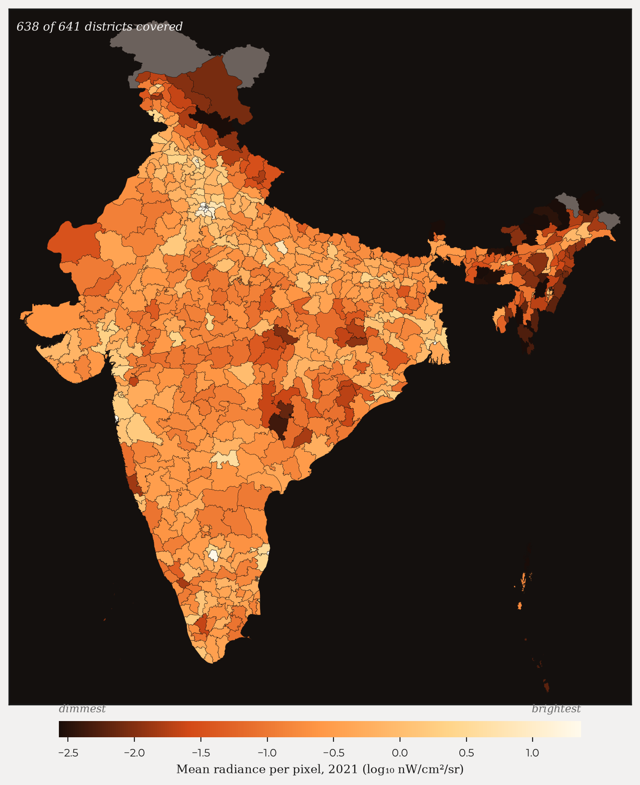
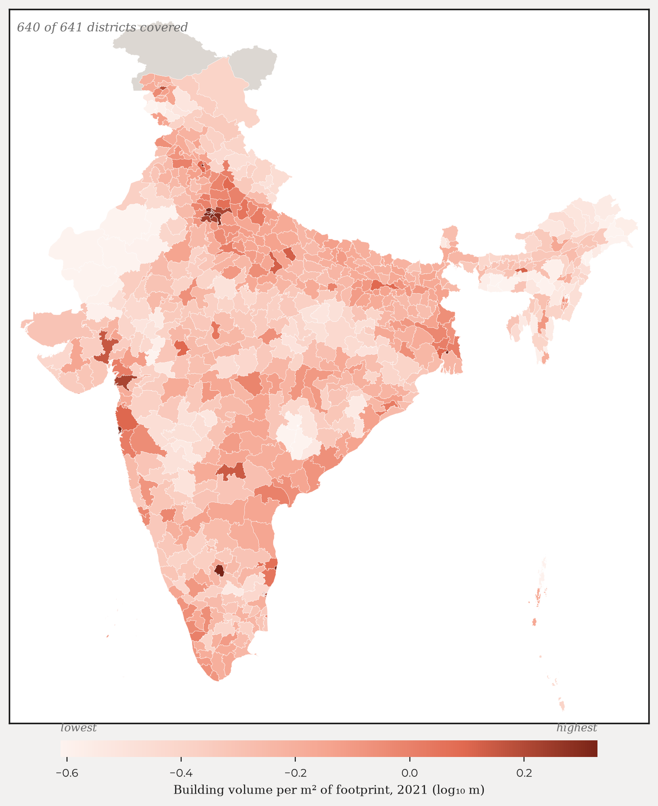
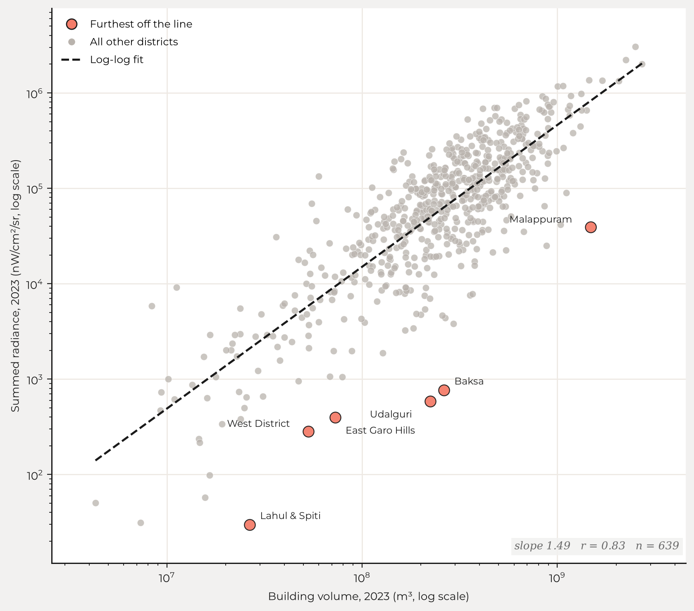
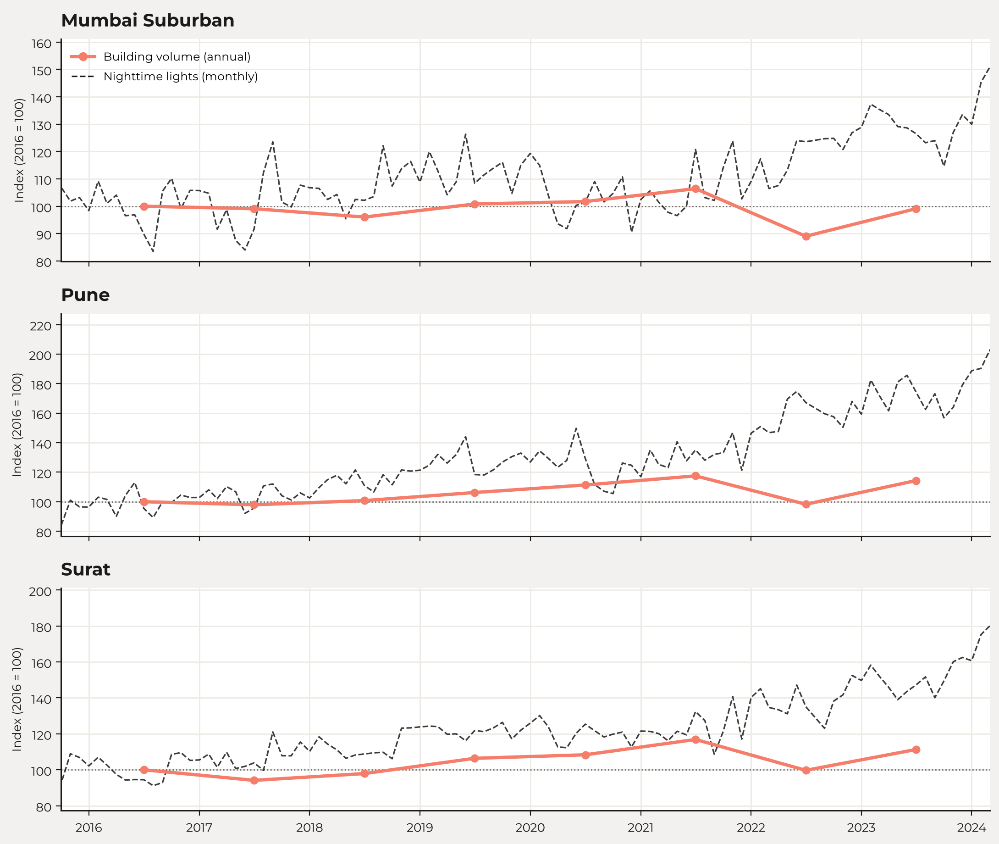
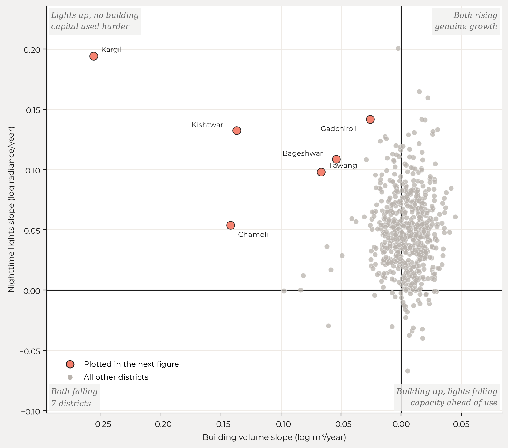
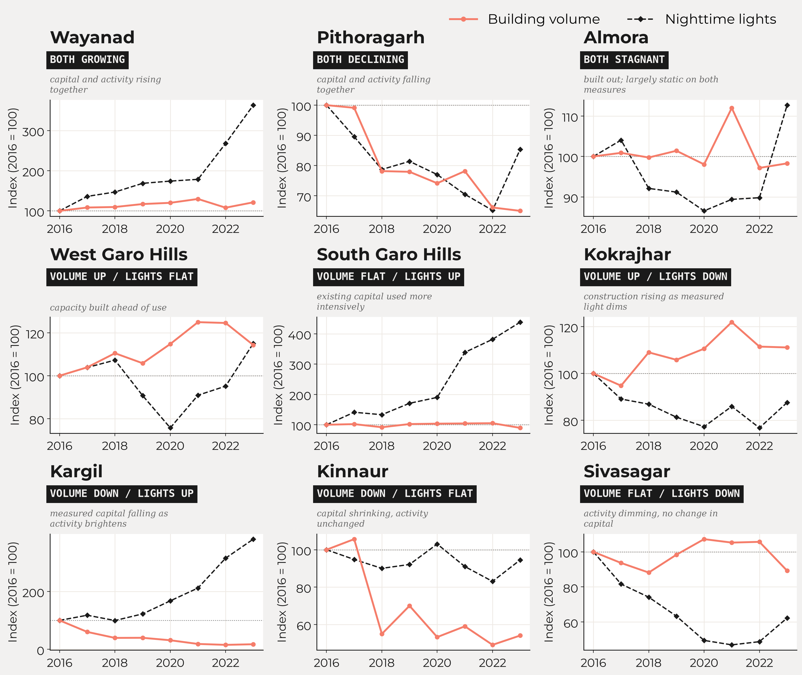

By Ayush Patnaik and Kapilan Mahalingam.

How fast is Pune growing, compared with Nagpur? Is Coimbatore catching up with Chennai? In India, these simple questions are surprisingly hard to answer.

The official statistics that describe the Indian economy are, for the most part, produced at state-level, once a year, often with a significant lag. Policy questions do not respect this. Infrastructure, industrial concentration and urbanisation play out at the district level, and the district is where the Indian statistical system is weakest. There is no official district-level measure of monthly economic activity. There is no official measure whatsoever of the stock of physical capital in a district, or of how fast it is changing. For much of what we would like to know about a district, the source is still a census from fifteen years ago.

We have built a new dataset to address this very problem, using satellite data. For each of 640 Indian districts, it gives two measures. The first is nighttime lights, monthly, from 2014 onwards: a flow measure of economic activity. The second is building volume, annually, from 2016 to 2023: a stock measure of physical capital. Both are derived from satellite imagery, both are released as CSVs, and the code that produces them is public.

Satellites were not designed as instruments of economic measurement. But every few days they record the surface of the earth, and economic activity leaves traces on that surface. Buildings appear. Towns spread outwards. Settlements brighten or dim after sunset as activity ebbs and flows. Henderson, Storeygard and Weil (2012) showed that the growth of nighttime lights tracks economic growth in places where the national accounts are weak, and Chen and Nordhaus (2011) worked out the conditions under which luminosity adds information to conventional statistics rather than restating them.

The difficulty is that raw satellite data is not usable as-is. It arrives in unfamiliar formats. It must be corrected for a long list of biases, and processing it at any scale requires serious computational heft. A researcher who wants a district-level series faces months of engineering before they can run their first regression. The purpose of this dataset is to do that engineering once, pubically, reproducibly, so that nobody has to do it again.

### Nighttime lights: a measure of economic activity

Nighttime lights are the older of the two measures, and economists have been using them for more than a decade. The data comes from the Visible Infrared Imaging Radiometer Suite (VIIRS) (Elvidge et al., 2021). We use the monthly series from 2014 onwards, at a resolution of 500 metres. For each pixel and month, VIIRS reports the average radiance and the number of cloud-free observations that went into it. Each district-month row in our dataset gives the sum of radiance across the district, the mean radiance per pixel, and the number of pixels.

Raw VIIRS data is messy. In earlier work at XKDR Forum (Patnaik, Shah and Thomas, 2022) we catalogued some of the more notable problems. Four, in particular. First, bloom: bright pixels spill light into their darker neighbours. Second, background noise: pixels with no lights at all do not report zero. Third, outliers: gas flares and fires produce readings that have nothing to do with economic activity. Fourth, and most important for India, seasonal attenuation: there is also a marked and poorly understood correlation between the number of cloud-free observations and the measured radiance (Patnaik et al., 2021). Consequently, in the monsoon months, there are fewer cloud-free observations, and the recorded radiance is biased downwards. A new user of the data will not know to correct for this, and the seasonality of clouds shows up as spurious seasonalities of the economy.

Because lights have been studied for so long, solutions exist. We take the raw data and run it through the PSTT2021 pipeline of Patnaik et al. (2021), as implemented in [NighttimeLights.jl](https://github.com/xKDR/NighttimeLights.jl), which corrects the bulk of these problems, and then aggregate to the district. The map below shows the result for 2021.

*Mean radiance per pixel, 2021, for 639 of the 640 districts. Dark is dim.*

Lights are a flow. They respond quickly: a neighbourhood brightens as it becomes more active, and dims when activity slows. This is what makes them useful at a monthly frequency. Beyer, Chhabra, Galdo and Rama (2018) worked with cleaned VIIRS data at the district level and traced the effect of demonetisation on Indian districts month by month, an episode that annual, state-level data would have largely smoothed away.

A word of caution. As household and street lighting shifts to LEDs, measured radiance can fall even where activity is rising, because LEDs emit less in the band that VIIRS is sensitive to (Kyba et al., 2017). A dimmer district is not necessarily a slower one. Gibson, Olivia and Boe-Gibson (2020) survey this and the other traps in the economic use of nighttime lights, and are worth reading before treating radiance as a direct measure of output.

### Building volume: a measure of the capital stock

The second measure is new. Google's [Open Buildings 2.5D Temporal](https://developers.google.com/earth-engine/datasets/catalog/GOOGLE_Research_open-buildings-temporal_v1) dataset (Sirko et al., 2023) is built from Sentinel-2 imagery at an effective resolution of 4 metres. It estimates not just where buildings stand but how tall they are, for every year from 2016 to 2023. Where the lights are high frequency, the buildings are high resolution. We resample the raw data to 100 metres, which is far quicker to process and is plenty for district-level work, and chunk the requests to stay within Google Earth Engine's limits. Each district-year row gives the total building footprint in the district, the mean building height, and the total building volume, which is the product of the two.

Building volume is a stock. It changes slowly, through the accumulation of investment in housing, industry and commerce. Buildings are rarely demolished on a scale that would show up at the district level, so in the ordinary course the series should rise, or stay flat, from one year to the next. The map below shows building volume per square metre of footprint in 2021, which is a rough measure of how tall a district builds rather than how much of it is built on. The dense corridors are visible without any further processing.

*Building volume per square metre of footprint, 2021, for 640 of the 641 districts. Note that the scale runs the other way from the map above: here dark is dense, not dim.*

These are the same districts in the same year, seen in concrete rather than in radiance. The densely built regions broadly match the bright ones, but not exactly. The Gangetic plain and the southern coasts are brighter than their building stock alone would suggest, and parts of the interior are dimmer. That gap is the reason for carrying both measures.

Here the contrast with nighttime lights is instructive. A decade of work has gone into understanding what is wrong with VIIRS data and how to fix it. For building volume, that literature does not yet exist. There are no papers cataloguing its biases and no established cleaning pipeline. We therefore release the building volume data as published by Google, without a cleaning pass of our own, and note its most significant problems in [our appendix](https://github.com/xKDR/India-Built-and-Lit/blob/main/blog/article_appendix.md).

There is one respect in which building volume has more potential than lights, and it is the reason for optimism despite these problems. The height of a building is an objective, verifiable measure. Municipal building registers, property tax rolls and structures of known height give a ground truth against which the satellite estimate can be checked and corrected. Seth, Singh and Uday (2026) have begun to do this in Karnataka: working with building volume inside urban local body boundaries, they find that the summed volume of a body explains much of the variation in its property tax demand. There is no comparable ground truth for the radiance of a district. We are working on a bias correction for building heights that uses known buildings as anchors for the distribution, and we expect that the cleaning methodology for this data will develop in the coming years, as it did for lights.

### Putting the two together

Each measure answers a straightforward question on its own. Together they answer a more useful one. Building volume is the stock of capital in a district; lights are the flow of activity running through it.

Across districts in a single year the two agree closely. In 2023 the correlation between log building volume and log radiance is 0.83, and the fitted slope is about 1.5: a district with twice the built volume of another is, on average, close to three times as bright. Some of that is size, since a larger district holds both more buildings and more lit pixels. What is useful is the spread around the line. The six districts furthest from it all lie on the same side, dim for what has been built, by factors of twenty to eighty, and five of the six are in the Himalayas or the Northeast. 

*Every district in 2023: building volume against summed radiance, both on log scales, with the fitted line. The named districts are the six furthest from it, all of them dimmer than their building stock would suggest.*

The difference in tempo is easiest to see when the two are drawn on the same axis. Building volume gives eight annual points across the period; lights give twelve times as many.

*Mumbai Suburban, Pune and Surat: monthly radiance against annual building volume, both indexed to 2016.*

Sorting districts by whether the stock and the flow are rising gives four kinds of district. Where both are climbing, a district is likely in the midst of genuine, sustained growth. Where construction is rising but lights are flat, capital is being put in place ahead of use. This is what one sees in a place that is being built out, such as a new industrial area. It is also what one sees in a real estate bubble, where the buildings are made and nobody comes. Where lights are rising with little new construction, existing capital is being used more intensively. That is consistent with constrained land, with limited confidence in long-term growth, or simply with a choice to extract more from what is already there. Where both are falling, the district is in decline.

*Every district, 2016 to 2023: the trend in building volume against the trend in nighttime lights. Most sit in the upper right; the named districts are the ones where the two measures disagree most.*

Most districts sit in the upper right, where both measures are rising. The interesting cases are where the two disagree. Splitting each measure three ways, into rising, flat and falling, gives nine combinations, of which eight are occupied. The empty one is rising volume with dimming lights. The chart below shows the starkest district in each of the eight: Wayanad, where building volume and lights climbed together; Pithoragarh, where both fell; Central Delhi, where both are flat, as one expects of a district that is built out; Lucknow, where construction ran ahead of measured activity; and so on through the remaining four.

*Building volume and nighttime lights, indexed to 2016, for the starkest district in each of the eight occupied combinations.*

### Obtaining the data

This dataset is for public consumption. It is released with the generating code, so that every number in it can be reproduced. The data is available as CSVs ([nighttime lights](https://xkdr.github.io/India-Built-and-Lit/data/viirs_monthly.csv), [building volume](https://xkdr.github.io/India-Built-and-Lit/data/bv_annual.csv), and [district boundaries](https://xkdr.github.io/India-Built-and-Lit/data/districts_simplified.geojson)). The processing pipeline runs end to end in two Colab notebooks, one for [nighttime lights](https://colab.research.google.com/github/xKDR/India-Built-and-Lit/blob/main/nighttime_lights.ipynb) and one for [building volume](https://colab.research.google.com/github/xKDR/India-Built-and-Lit/blob/main/building_volume.ipynb). One note: the nighttime lights CSV was computed at native resolution (500m), while the notebook downsamples in order to stay within Colab's usage limits. Point the notebooks at a different set of boundaries, whether another country or another administrative level, and the pipelines will run unchanged.

We built this for two audiences. The first is researchers working on regional inequality, urbanisation and the geography of growth, who have, until now, had to choose between district level data and time series data. The second is anyone in government who needs to know what is happening in a place where the official numbers arrive late, or not at all.

This is a first step. There is a great deal of work to be done: on the bias correction of building heights, on the LED problem in lights, and on validating both measures against ground truth wherever it exists. Economic development leaves visible traces on the landscape long before it reaches official databases. We hope that researchers will use this data, find its problems, and help us improve it.

### References

*[Measuring districts' monthly economic activity from outer space](https://openknowledge.worldbank.org/entities/publication/86379208-572b-50af-af6c-9c08ece68edc/full)*, Robert Beyer, Esha Chhabra, Virgilio Galdo and Martin Rama, World Bank Policy Research Working Paper No. 8523, July 2018.

*[Using luminosity data as a proxy for economic statistics](https://www.pnas.org/doi/10.1073/pnas.1017031108)*, Xi Chen and William D. Nordhaus, Proceedings of the National Academy of Sciences, Vol. 108, No. 21, May 2011.

*[VIIRS night-time lights](https://doi.org/10.4324/9781003169246-1)*, Christopher D. Elvidge, Kimberly Baugh, Mikhail Zhizhin, Feng Chi Hsu and Tilottama Ghosh, in Remote Sensing of Night-time Light, Routledge, 2021.

*[Night lights in economics: Sources and uses](https://onlinelibrary.wiley.com/doi/abs/10.1111/joes.12387)*, John Gibson, Susan Olivia and Geua Boe-Gibson, Journal of Economic Surveys, Vol. 34, No. 5, December 2020.

*[Measuring economic growth from outer space](https://www.aeaweb.org/articles?id=10.1257/aer.102.2.994)*, J. Vernon Henderson, Adam Storeygard and David N. Weil, American Economic Review, Vol. 102, No. 2, April 2012.

*[Artificially lit surface of Earth at night increasing in radiance and extent](https://www.science.org/doi/10.1126/sciadv.1701528)*, Christopher C. M. Kyba and others, Science Advances, Vol. 3, No. 11, November 2017.

*[But clouds got in my way: Bias and bias correction of VIIRS nighttime lights data in the presence of clouds](https://xkdr.org/paper/but-clouds-got-in-my-way-bias-and-bias-correction-of-viirs-nighttime-lights-data-in-the-presence-of-clouds)*, Ayush Patnaik, Ajay Shah, Anshul Tayal and Susan Thomas, XKDR Forum Working Paper No. 7, October 2021.

*[Foundations for nighttime lights data analysis](https://xkdr.org/paper/foundations-for-nighttime-lights-data-analysis)*, Ayush Patnaik, Ajay Shah and Susan Thomas, XKDR Forum Working Paper No. 19, December 2022.

*[Estimating property tax potential in urban local bodies using satellite imagery](https://www.xkdr.org/paper/estimating-property-tax-potential-in-urban-local-bodies-using-satellite-imagery)*, Abhishek Seth, Manish K. Singh and Diya Uday, XKDR Forum Working Paper No. 47, March 2026.

*[High-resolution building and road detection from Sentinel-2](https://arxiv.org/abs/2310.11622)*, Wojciech Sirko, Emmanuel Asiedu Brempong, Juliana T. C. Marcos, Abigail Annkah, Abel Korme, Mohammed Alewi Hassen, Krishna Sapkota, Tomer Shekel, Abdoulaye Diack, Sella Nevo and others, arXiv:2310.11622, 2023.

### Acknowledgments

The authors are researchers at XKDR Forum, Mumbai.
